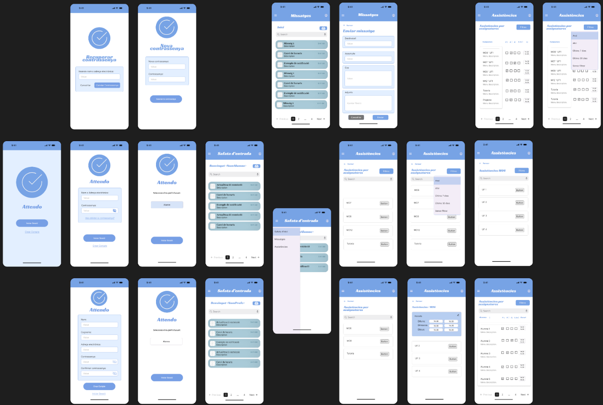

# Attendo: Gestió d'assistències
Attendo és una aplicació desenvolupada per gestionar l'assistència en diferents entorns, com ara escoles. 
Aquesta eina permet registrar i supervisar l'assistència dels participants de manera eficient i senzilla.

## Explicació clau
L’aplicació gestiona l'assistència dels estudiants a les classes, llavors la funcionalitat d’aquesta app és saber el seguiment dels usuaris. 
Existeixen tipus d’usuaris a l’aplicació mòbil: professors i estudiants, els administradors gestionen tot directamente desde la base de dades. 
Tots els usuaris es registrem com a alumnes però els administradors donen permisos de professorat a tot el personal que ho sigui.
- L'Alumne/a: haurà de poder accedir a la seva pròpia informació.
- Professorat: podran passar llista, veure l’assistència dels seus grups, afegir-se el seu horari, modificar l'assistència, etc.

### Característiques principals
- Permet als administradors registrar l'assistència diària dels participants, incloent-hi presències, absències i justificacions.
- Gestió d'usuaris: Facilita l'addició, modificació i eliminació de perfils d'usuaris amb diferents rols i permisos.
- Interfície intuïtiva: Disseny basic gràcies a l'ús de tecnologies com Java.

### Funcionament de l'aplicació
Primerament, quan s’obre l’aplicació demana als usuaris iniciar sessió per tal d’accedir a tota la informació, sense tenir en compte si és alumne o professorat. 
Es requereix un nom i una contrasenya per tal d’accedir si ja es té un compte, en el cas contrari només s’ha d’afegir un correu electrònic i confirmar la contrasenya dues vegades. 
Una vegada que es troba dins, surt la safata d’entrada, que és una vista general amb últimes notificacions i un menú per tal d’accedir a altres apartats o funcionalitats. 
Aquest menú es caracteritza per tenir opcions com safata d'entrada, assistències, entre altres.  Tant l'alumne com el professorat es poden accedir a aquesta vista, enviar missatges i revisar els mòduls que necessiten. 
L'alumne pot accedir a la seva pròpia informació, però no pot realitzar cap acció, com modificar les seves assistències. 
Per el contrari, el professorat pot accedir a les seves dades i modificar les assistències dels seus alumnes.

### Wireframe de l'aplicació

## Creació i desenvolupament de l’app Assistències

Per desenvolupar aquesta aplicació es va tenir en compte uns requeriments bàsics per a la funcionalitat de la aplicació Assistències. Els quals són com a alumne usuari, poder consultar i veure la seva informació com a missatges classes i assistències que té. Com a professorat suari, poder veure els seus alumnes i poder modificarlos. Un punt a tenir en compte és que no hi ha administrador usuari, ja que s’executa tots els canvis directament a la base de dades, que només tenen accés els administradors.

L’aplicació està dissenyada perquè l’usuari pugui accedir-hi iniciant sessió. Un cop l'usuari obre l’aplicació, se li demana que iniciï sessió (usuari i contrasenya). Si no té compte, té l’opció de crear-ne un nou. En aquest cas, l'usuari ha d’omplir un formulari amb les dades necessàries, com el seu correu electrònic, nom d'usuari i contrasenya, per crear un compte.

NOTA: Aquesta apliacació es va desenvolupar en un temps molt limitat, funcionalitats no completes i estructura a millorar. Pendent de millora.

# Més informació
Per informació més detallada consulteu en aquest document:

https://docs.google.com/document/d/1i8r-fE9A190US-r-d-sBDuRQj7i1GsngEfE9_bnIdIs/edit?usp=sharing